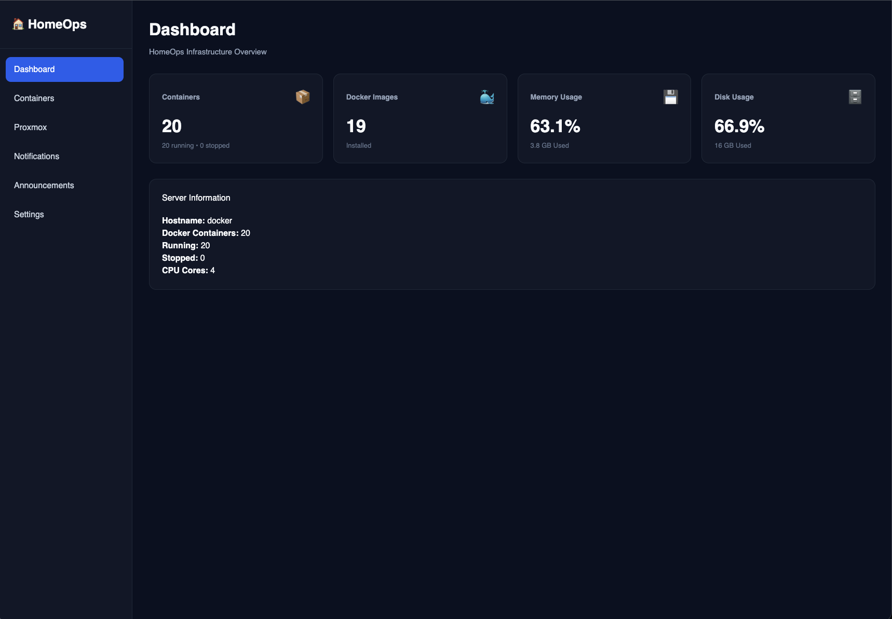
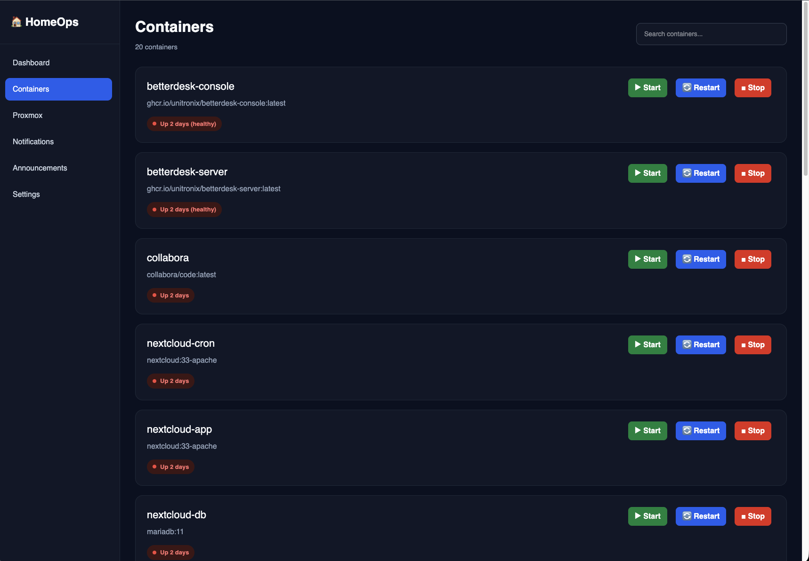

<div align="center">

# 🏠 HomeOps V2

### A Modern Operations Platform for Proxmox, Docker & Self-Hosted Infrastructure

Manage your entire homelab from one modern, fast and extensible interface.


</div>

---

# 📖 Overview

HomeOps V2 is an open-source operations platform built for self-hosted infrastructure.

Rather than switching between multiple web interfaces, HomeOps provides a single location to monitor, manage and automate your entire homelab.

Whether you're running a single Proxmox server or a full cluster with Docker, media services, authentication, monitoring and automation, HomeOps is designed to become your central operations console.

Built with **React**, **Fastify** and **TypeScript**, HomeOps focuses on performance, simplicity and scalability while remaining easy to extend with additional integrations.

---

# 🎯 Why HomeOps?

Modern homelabs often contain dozens of services.

- Proxmox
- Docker
- Jellyfin
- Immich
- Vaultwarden
- Pi-hole
- Nextcloud
- Authentik
- Homepage
- AMP
- Grafana
- Prometheus

Every service has its own web interface.

HomeOps brings them together into one clean, consistent experience.

Instead of replacing these applications, HomeOps acts as the **operations layer** above them.

---

# ✨ Current Features

## 🖥️ Infrastructure

- Proxmox Cluster Overview
- Multi-node support
- Live node statistics
- Virtual Machine overview
- LXC overview
- CPU monitoring
- Memory monitoring
- Disk monitoring
- VM Power Controls
- LXC Power Controls
- Automatic refresh

---

## 🐳 Docker

- Docker integration
- Portainer API integration
- Container overview
- Container search
- Start containers
- Stop containers
- Restart containers
- Health monitoring

---

## 📊 Dashboard

- Infrastructure summary
- Resource usage
- Cluster statistics
- Responsive layout
- Modern dark interface

---

## 🎨 User Interface

- Modern design
- Responsive layout
- Component-based architecture
- TypeScript throughout
- Reusable UI components

---

# 📸 Screenshots

## 🏠 Dashboard

Infrastructure overview with live resource usage.



---

## 🐳 Docker

Manage Docker containers through the Portainer API.

- Start
- Stop
- Restart
- Search
- Health Status



---

## 🖥️ Proxmox

Monitor your entire Proxmox cluster from one page.

- Nodes
- Virtual Machines
- Linux Containers
- Resource Usage
- Live Status
- Power Controls


---

# 🚧 Development Status

## ✅ Completed

- React Frontend
- Fastify Backend
- Docker Integration
- Portainer Integration
- Proxmox Integration
- VM Power Controls
- LXC Power Controls
- Live Status Monitoring
- Responsive Dashboard

---

## 🚧 In Progress

- Component Library
- Node Details
- VM Details
- LXC Details
- Notification System
- Authentication
- Better UI Components

---

## 📅 Planned

- Asset Inventory
- Case Management
- Documentation
- Monitoring
- Service Integrations
- Maintenance Mode
- Automation Engine

---

# 🗺️ Roadmap

## Version 2.1

- ✅ Dashboard
- ✅ Docker Integration
- ✅ Portainer Integration
- ✅ Proxmox Integration
- ✅ VM Controls
- ✅ LXC Controls
- 🚧 Node Detail Pages
- 🚧 VM Detail Pages
- 🚧 LXC Detail Pages
- 🚧 Task Monitoring

---

## Version 2.2

- Docker Compose Management
- Docker Images
- Docker Networks
- Docker Volumes
- Container Logs
- Container Terminal

---

## Version 2.3

- Authentik SSO
- Active Directory Login
- Role Based Access Control
- User Management
- Audit Logging

---

## Version 2.4

- Jellyfin Integration
- Plex Integration
- Immich Integration
- Vaultwarden Integration
- AdGuard Home
- Homepage
- Nextcloud

---

## Version 3.0

- Asset Inventory
- Rack View
- Network Topology
- Case Management
- Project Management
- Maintenance Scheduler
- Notification Center
- Workflow Automation

---

# 🏗️ Architecture

```text
                           Browser
                               │
                               ▼
                     React + TypeScript
                               │
                          REST API
                               │
                               ▼
                     Fastify Backend API
                               │
       ┌──────────────┬──────────────┬──────────────┐
       │              │              │
       ▼              ▼              ▼
  Proxmox API    Portainer API   Future Services
                                       │
      ┌──────────────┬──────────────┬──────────────┐
      ▼              ▼              ▼
  Jellyfin       Immich       Authentik
      ▼              ▼              ▼
 Nextcloud    Vaultwarden   AdGuard Home
```

---

# 🛠️ Tech Stack

## Frontend

- React
- Vite
- TypeScript

## Backend

- Fastify
- Axios
- TypeScript

## APIs

- Proxmox VE API
- Portainer API

## Future Integrations

- Jellyfin
- Immich
- Authentik
- Nextcloud
- Vaultwarden
- AdGuard Home
- Homepage
- TrueNAS

---

# 📁 Project Structure

```text
HomeOps-V2/
│
├── backend/
│   ├── src/
│   │   ├── routes/
│   │   ├── services/
│   │   ├── plugins/
│   │   ├── middleware/
│   │   └── index.ts
│   └── .env
│
├── frontend/
│   ├── src/
│   │   ├── api/
│   │   ├── components/
│   │   ├── pages/
│   │   ├── hooks/
│   │   ├── layouts/
│   │   └── styles/
│   └── public/
│
├── docs/
│
├── README.md
└── LICENSE
```

---

# 🚀 Installation

Clone the repository.

```bash
git clone https://github.com/TJ-HomeOps/HomeOps-V2.git
cd HomeOps-V2
```

---

## Backend

```bash
cd backend
npm install
```

Create a `.env` file.

```env
PORTAINER_URL=https://PORTAINER-IP:9443/api
PORTAINER_TOKEN=

PROXMOX_URL=https://PROXMOX-IP:8006
PROXMOX_TOKEN_ID=
PROXMOX_TOKEN_SECRET=
```

Run the backend.

```bash
npm run dev
```

---

## Frontend

```bash
cd ../frontend
npm install
```

Create a `.env` file.

```env
VITE_API_URL=http://localhost:3000
```

Run the frontend.

```bash
npm run dev
```

---

# ⚙️ Environment Variables

## Backend

| Variable | Description |
|-----------|-------------|
| PORTAINER_URL | Portainer API URL |
| PORTAINER_TOKEN | Portainer API Token |
| PROXMOX_URL | Proxmox API URL |
| PROXMOX_TOKEN_ID | Proxmox API Token ID |
| PROXMOX_TOKEN_SECRET | Proxmox API Token Secret |

---

## Frontend

| Variable | Description |
|-----------|-------------|
| VITE_API_URL | Backend API URL |

---

# 🔮 Planned Integrations

## Infrastructure

- Proxmox
- Docker
- Kubernetes
- VMware

---

## Media

- Jellyfin
- Plex
- Immich
- Navidrome
- Audiobookshelf

---

## Authentication

- Authentik
- Active Directory
- LDAP

---

## Storage

- TrueNAS
- Synology DSM
- Unraid

---

## Monitoring

- Prometheus
- Grafana
- Uptime Kuma
- Beszel

---

## Networking

- AdGuard Home
- Pi-hole
- pfSense
- OPNsense

---

# 💡 Long-Term Vision

HomeOps is not intended to replace Proxmox, Docker or other self-hosted applications.

Instead, HomeOps provides a unified operations platform that brings them together into one consistent experience.

The goal is to create a single application where you can:

- Monitor infrastructure
- Manage virtual machines
- Control containers
- View logs
- Track backups
- Receive alerts
- Manage users
- Document your environment
- Track maintenance
- Manage projects
- Automate common tasks

Without constantly switching between different web interfaces.

---

# 🤝 Contributing

Contributions are always welcome.

You can help by:

- ⭐ Starring the repository
- 🐛 Reporting bugs
- 💡 Suggesting new features
- 🔧 Opening pull requests
- 📖 Improving documentation

---

# 📄 License

This project is licensed under the MIT License.

See the `LICENSE` file for details.

---

# ❤️ About

HomeOps V2 started as a personal project to simplify the management of an expanding Proxmox homelab.

As more services were added, including Docker, media servers, authentication, backups and monitoring, constantly switching between different management interfaces became increasingly inefficient.

HomeOps was created to solve that problem.

The long-term vision is to build a fast, modern and extensible operations platform that provides a single pane of glass for self-hosted infrastructure.

Whether you're running a small home server or a full enterprise-style homelab, HomeOps aims to make infrastructure management simple, intuitive and enjoyable.

---

<div align="center">

## ⭐ Star the project if you find it useful!

Built with ❤️ for the Homelab & Self-Hosting Community.

**HomeOps V2** • One Dashboard. Complete Control.

</div>
