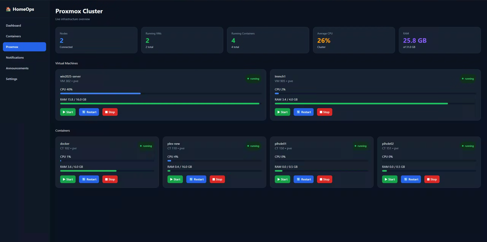

<div align="center">

# 🏠 HomeOps V2

### Modern Infrastructure Dashboard for Proxmox, Docker & Self-Hosted Services

A clean, modern dashboard that brings your entire homelab together in one place.


</div>

---

# 📖 Overview

HomeOps V2 is a modern operations dashboard built to simplify the management of self-hosted infrastructure.

Instead of switching between multiple web interfaces, HomeOps provides a unified platform for monitoring and controlling your Proxmox cluster, Docker environment, and eventually all of your self-hosted services.

Built with **React**, **Fastify**, and **TypeScript**, HomeOps focuses on speed, simplicity, and extensibility while providing a modern user experience.

---

# ✨ Features

## 📊 Dashboard

- Infrastructure overview
- Live system statistics
- Memory usage
- Disk usage
- Docker statistics
- Responsive interface

## 🐳 Docker

- View Docker containers
- Search containers
- Start containers
- Stop containers
- Restart containers
- Health status
- Portainer integration

## 🖥️ Proxmox

- Multi-node support
- Node overview
- Virtual Machine overview
- LXC overview
- CPU usage
- Memory usage
- Disk usage
- Power controls
- Live status monitoring

---

# 📸 Screenshots

## 🏠 Dashboard

Infrastructure overview showing resource usage and server information.


---

## 🐳 Docker Containers

Manage your Docker environment through the Portainer API.

- Start
- Stop
- Restart
- Search
- Health Status


---

## 🖥️ Proxmox Cluster

Monitor nodes, virtual machines and Linux containers in real time.



---

# 🚧 Roadmap

| Feature | Status |
|---------|:------:|
| Dashboard | ✅ |
| Docker Integration | ✅ |
| Portainer Integration | ✅ |
| Proxmox Integration | ✅ |
| VM Controls | ✅ |
| LXC Controls | ✅ |
| Live Status | ✅ |
| Container Search | ✅ |
| Authentik SSO | 🚧 |
| Active Directory Login | 🚧 |
| Docker Image Management | 🚧 |
| Docker Compose Management | 🚧 |
| VM Creation | 📅 |
| LXC Creation | 📅 |
| Snapshot Management | 📅 |
| Notifications | 📅 |
| Health Monitoring | 📅 |
| Backup Monitoring | 📅 |
| Project Management | 📅 |
| Case Management | 📅 |
| Service Integrations | 📅 |

---

# 🏗️ Architecture

```text
                    Browser
                        │
                        ▼
        ┌────────────────────────────┐
        │      React + Vite UI       │
        └──────────────┬─────────────┘
                       │
                    REST API
                       │
                       ▼
        ┌────────────────────────────┐
        │      Fastify Backend       │
        └───────────┬────────┬───────┘
                    │        │
                    ▼        ▼
             Proxmox API   Portainer API
```

---

# 🛠️ Tech Stack

### Frontend

- React
- Vite
- TypeScript

### Backend

- Fastify
- TypeScript
- Axios

### APIs

- Proxmox VE API
- Portainer API

---

# 📁 Project Structure

```text
HomeOps-V2/
│
├── backend/
│   ├── src/
│   ├── routes/
│   ├── services/
│   └── .env
│
├── frontend/
│   ├── src/
│   ├── public/
│   └── .env
│
├── docs/
│   ├── dashboard.png
│   ├── containers.png
│   └── proxmox.png
│
├── README.md
└── LICENSE
```

---

# 🚀 Installation

Clone the repository.

```bash
git clone git@github.com:TJ-HomeOps/HomeOps-V2.git
cd HomeOps-V2
```

---

## Backend

Install dependencies.

```bash
cd backend
npm install
```

Create a `.env` file inside the `backend` folder.

```env
PORTAINER_URL=https://<PORTAINER-IP>:9443/api
PORTAINER_TOKEN=

PROXMOX_URL=https://<PROXMOX-IP>:8006
PROXMOX_TOKEN_ID=
PROXMOX_TOKEN_SECRET=
```

Start the backend.

```bash
npm run dev
```

---

## Frontend

Install dependencies.

```bash
cd ../frontend
npm install
```

Create a `.env` file inside the `frontend` folder.

```env
VITE_API_URL=http://localhost:3000
```

If your backend is running on another server, replace `localhost` with its IP address or hostname.

Example:

```env
VITE_API_URL=http://192.168.1.100:3000
```

Start the frontend.

```bash
npm run dev
```

---

# ⚙️ Environment Variables

## Backend

| Variable | Description |
|----------|-------------|
| `PORTAINER_URL` | Portainer API URL |
| `PORTAINER_TOKEN` | Portainer API Token |
| `PROXMOX_URL` | Proxmox API URL |
| `PROXMOX_TOKEN_ID` | Proxmox API Token ID |
| `PROXMOX_TOKEN_SECRET` | Proxmox API Token Secret |

## Frontend

| Variable | Description |
|----------|-------------|
| `VITE_API_URL` | URL of the HomeOps backend |

---

# 🔮 Planned Features

### Authentication

- Authentik SSO
- Active Directory integration
- Role-based access control

### Infrastructure

- Docker image management
- Docker Compose management
- VM creation
- LXC creation
- Snapshot management

### Monitoring

- Live WebSocket updates
- Email notifications
- Discord notifications
- Resource alerts
- Backup monitoring
- Historical metrics

### Self-Hosted Integrations

- Jellyfin
- Plex
- Immich
- Nextcloud
- Vaultwarden
- AdGuard Home
- Homepage
- TrueNAS
- Grafana
- Prometheus

### Productivity

- Project management
- Case management
- Documentation
- Notes
- Maintenance scheduler

---

# 🤝 Contributing

Contributions are welcome!

If you'd like to improve HomeOps, you can:

- ⭐ Star the repository
- 🐞 Report bugs
- 💡 Suggest features
- 🔧 Submit pull requests

---

# 📄 License

This project is licensed under the MIT License.

See the `LICENSE` file for more information.

---

# ❤️ About

HomeOps V2 began as a personal project to simplify the management of an expanding Proxmox homelab.

As additional services such as Docker, media servers, authentication, monitoring, backups, and automation were added, managing everything through separate web interfaces became increasingly time-consuming.

The long-term vision is to create a single, modern operations platform that unifies self-hosted infrastructure into one fast, intuitive, and extensible dashboard.

Whether you're managing a single Proxmox node or an entire homelab, HomeOps aims to provide the tools you need to keep everything running smoothly.

---

<div align="center">

### ⭐ If you find HomeOps useful, consider giving the project a Star!

Made with ❤️ for the self-hosting and homelab community.

</div>
