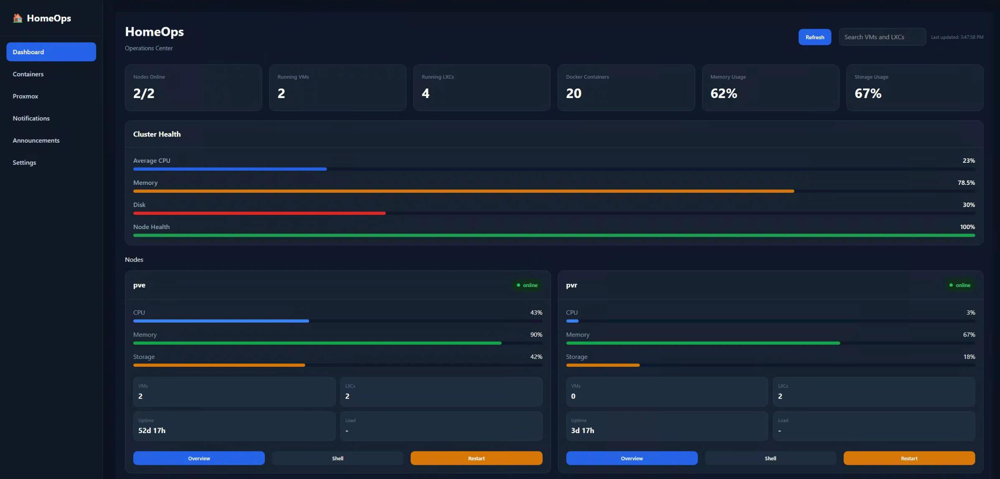
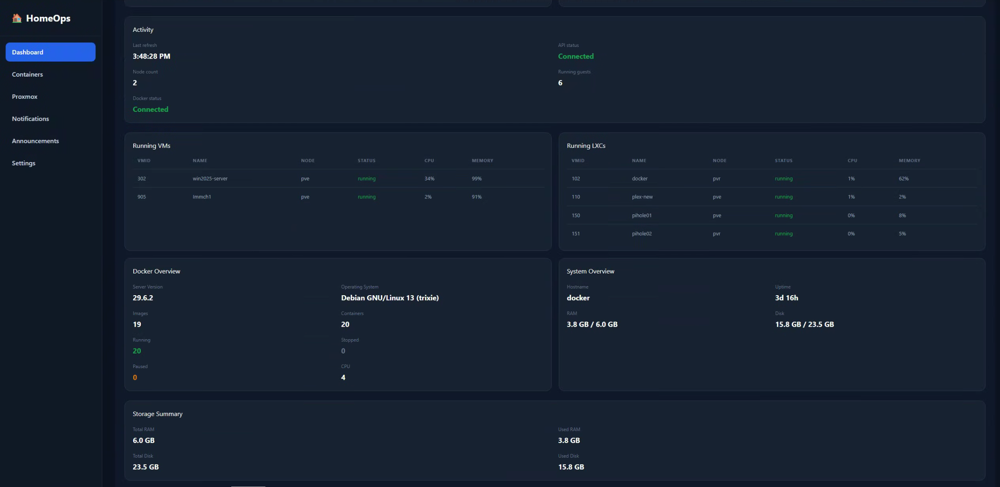

<div align="center">

# 🚀 HomeOps V2

### Modern Infrastructure Management for Homelabs

A modern web-based operations center for managing your **Proxmox VE infrastructure**, **Docker hosts**, **virtual machines**, **LXC containers**, and system resources from one beautiful dashboard.

<p>
    
    
    
    
    
    
</p>

---



*The all-in-one dashboard for self-hosters and homelab enthusiasts.*

</div>

---

# 📖 About

HomeOps V2 is a complete rewrite of the original HomeOps project.

Its goal is to provide a fast, modern, and intuitive interface for managing your self-hosted infrastructure without constantly switching between multiple web interfaces.

Instead of opening separate dashboards for Proxmox, Docker, monitoring tools, and system utilities, HomeOps brings everything together into one centralized operations center.

The frontend communicates only with the HomeOps backend, which transforms infrastructure data into a clean, consistent API specifically designed for the UI.

---

# ✨ Features

## 🖥️ Infrastructure Dashboard

- Real-time Cluster Overview
- Node Health Monitoring
- Running Virtual Machines
- Running LXC Containers
- Docker Monitoring
- System Metrics
- Storage Summary
- Automatic Refresh
- Guest Search
- Responsive Design

---

## ⚡ Dashboard Highlights

- 📊 Cluster Health
- 📦 Running Guests
- 🐳 Docker Overview
- 💾 Storage Usage
- 💻 System Information
- 🔄 Automatic Refresh (10 seconds)
- 🔍 Search Running Guests
- 🎨 Modern Responsive UI
- 🔒 Strict TypeScript

---

## 🖥️ Proxmox Integration

- Cluster Overview
- Node Statistics
- Virtual Machines
- LXC Containers
- Resource Usage
- Health Monitoring

---

## 🐳 Docker Integration

- Running Containers
- Images
- Container Statistics
- Server Information
- CPU Information
- Operating System

---

## 💻 System Monitoring

- Hostname
- Uptime
- RAM Usage
- Disk Usage
- Storage Summary

---

# 📸 Screenshots

## 🏠 Dashboard

<p align="center">


</p>

The Dashboard provides a complete overview of your infrastructure, including cluster health, running guests, Docker statistics, storage usage, and real-time system metrics.

---

## 🖥️ Proxmox Overview

<p align="center">

</p>

View your Proxmox cluster with detailed node information, virtual machines, LXC containers, resource utilization, and overall cluster health.

---

## 🐳 Docker Overview

<p align="center">

</p>

Monitor your Docker environment with container statistics, image counts, server information, runtime status, and resource usage.

---

# ⚙️ Technology Stack

## Frontend

- React 19
- TypeScript
- Vite
- CSS
- Component-Based Architecture

## Backend

- Node.js
- Fastify
- TypeScript

## Infrastructure

- Proxmox VE
- Docker
- Linux

---

# 🏗️ Architecture

```text
                    React Frontend
                          │
                          │
                     REST API
                          │
                    Fastify Backend
                          │
      ┌─────────────┬──────────────┬──────────────┐
      │             │              │              │
 Proxmox VE      Docker API     System API    Future Services
```

The frontend never communicates directly with Proxmox or Docker.

Instead, HomeOps exposes its own API layer that transforms infrastructure data into a consistent format optimized for the user interface.

This keeps the frontend simple while allowing backend integrations to evolve independently.

---

# 🚀 Current Features

## Dashboard

- ✅ Cluster Overview
- ✅ Node Cards
- ✅ Cluster Health
- ✅ Activity Panel
- ✅ Running VM Table
- ✅ Running LXC Table
- ✅ Docker Overview
- ✅ System Overview
- ✅ Storage Summary

---

## Monitoring

- ✅ CPU Usage
- ✅ Memory Usage
- ✅ Storage Usage
- ✅ Node Health
- ✅ Running Guests
- ✅ Docker Statistics

---

## User Experience

- ✅ Automatic Refresh
- ✅ Search
- ✅ Responsive Layout
- ✅ Strict TypeScript
- ✅ Fast Loading

---

# 📁 Project Structure

```text
HomeOps-V2/
│
├── backend/
│   ├── api/
│   ├── lib/
│   ├── routes/
│   └── services/
│
├── frontend/
│   ├── api/
│   ├── components/
│   ├── pages/
│   ├── theme/
│   └── utils/
│
└── docs/
    ├── dashboard.png
    ├── docker.png
    └── proxmox.png
```

---

# 🚀 Getting Started

## Clone the repository

```bash
git clone https://github.com/TJ-HomeOps/HomeOps-V2.git

cd HomeOps-V2
```

## Backend

```bash
cd backend

npm install

npm run dev
```

## Frontend

```bash
cd frontend

npm install

npm run dev
```

---

# 🛣️ Roadmap

## ✅ Phase 1

- Dashboard
- Proxmox Integration
- Docker Integration
- System Monitoring
- Cluster Health
- Automatic Refresh
- Search

---

## 🚧 Phase 2

- HomeOps API Refactor
- Node Details
- VM Details
- LXC Details
- Power Controls
- Docker Management

---

## 🔜 Phase 3

- WebSocket Live Updates
- Historical Metrics
- Notifications
- Alerting
- Audit Logs
- User Preferences

---

## 🌍 Phase 4

- Authentik Authentication
- Role Based Access Control
- Multi-Cluster Support
- Plugin System
- REST API Documentation

---

# 💡 Development Philosophy

HomeOps follows a few simple principles.

- 🚀 Fast
- 🎨 Modern
- 🔒 Type Safe
- 🧩 Extensible
- 🏠 Self-Hosting First
- ⚙️ API Driven

The frontend should remain clean and simple.

Infrastructure-specific logic belongs in the backend, allowing the frontend to consume a consistent HomeOps API regardless of how external services are integrated.

---

# 🤝 Contributing

Contributions are always welcome.

Whether it's:

- 🐛 Bug Reports
- 💡 Feature Requests
- 📝 Documentation Improvements
- 🔧 Pull Requests

every contribution helps improve HomeOps.

If you're planning a major feature, please open an Issue first so ideas can be discussed.

---

# 💡 Why HomeOps?

Managing a homelab often means juggling multiple dashboards:

- Proxmox
- Docker
- Monitoring tools
- Storage
- Networking
- Virtual Machines
- Containers

HomeOps aims to simplify that experience by bringing everything together into a single, modern interface.

Rather than exposing raw APIs directly to the frontend, HomeOps transforms infrastructure data into a unified platform designed specifically for administrators.

The long-term vision is to become the central operations hub for modern homelabs while remaining lightweight, fast, and easy to extend.

---

# ❤️ Acknowledgements

HomeOps would not be possible without the incredible open-source community.

Special thanks to the teams behind:

- ❤️ Proxmox VE
- ❤️ Docker
- ❤️ React
- ❤️ Vite
- ❤️ Fastify
- ❤️ TypeScript

Thank you to everyone who contributes to the self-hosting and homelab communities by sharing knowledge, ideas, and inspiration.

---

# 📄 License

This project is licensed under the **MIT License**.

See the [LICENSE](LICENSE) file for complete details.

---

<div align="center">

## ⭐ Support the Project

If you enjoy HomeOps or find it useful, consider giving the repository a **⭐ Star**.

It helps others discover the project and supports future development.

---

**Built with ❤️ for the Self-Hosting & Homelab Community**

© 2026 HomeOps Project

</div>
