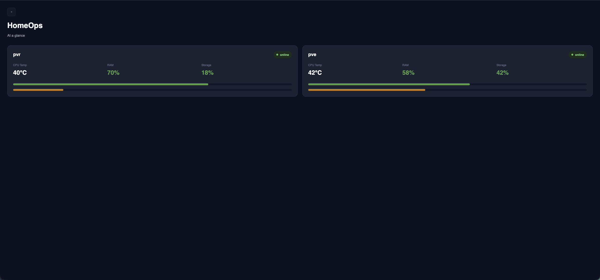
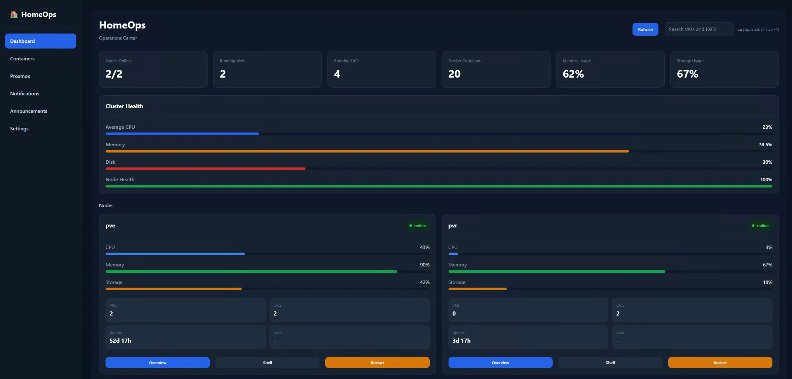
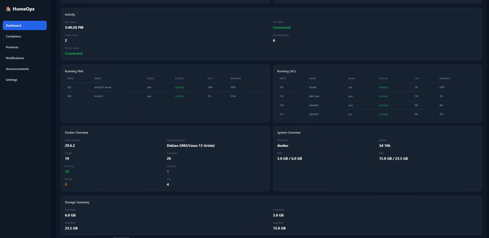
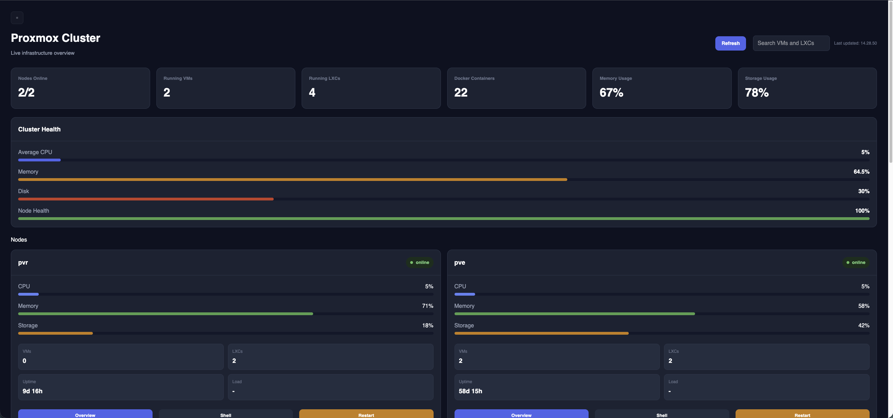
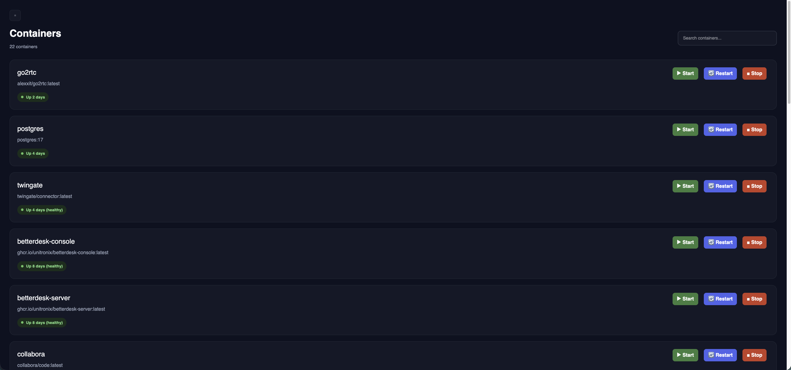

<div align="center">

# 🚀 HomeOps V2

### Modern Infrastructure Management for Homelabs

A modern web-based operations center for managing your **Proxmox VE infrastructure**, **Docker hosts**, **virtual machines**, **LXC containers**, and system resources from one beautiful dashboard.

<p>
    
    
    
    
    
    
</p>

---



*The all-in-one dashboard for self-hosters and homelab enthusiasts.*

</div>

---

# 📖 About

HomeOps V2 is a complete rewrite of the original HomeOps project.

Its goal is to provide a fast, modern, and intuitive interface for managing your self-hosted infrastructure without constantly switching between multiple web interfaces.

Instead of opening separate dashboards for Proxmox, Docker, monitoring tools, and system utilities, HomeOps brings everything together into one centralized operations center.

The frontend communicates only with the HomeOps backend, which transforms infrastructure data into a clean, consistent API specifically designed for the UI.

---

# ✨ Features

## 🏠 Dashboard — At a Glance

The landing page is a minimal status board, designed to stay open on a second screen or tablet rather than be dug through: one tile per Proxmox node showing

- Online / offline status
- CPU temperature
- RAM usage %
- Storage usage %

Tap a tile to jump straight into that node's full detail page. Everything else — cluster health, resource history, running guests, Docker and system overview — lives on the Proxmox page instead, one level deeper.

---

## 🧭 Collapsible Sidebar

The sidebar can be collapsed to give small screens (like a tablet) more room, with the choice remembered across reloads.

---

## 🖥️ Proxmox Integration

This is the in-depth operations hub — everything the Dashboard deliberately leaves out lives here: cluster health, per-node cards with resource history charts, an activity panel, searchable VM/LXC cards with start/stop/restart, and Docker + system overview panels.

- Cluster Overview
- Node Statistics
- Virtual Machines
- LXC Containers
- Resource Usage
- Health Monitoring
- Multi-Cluster Support — connect more than one Proxmox cluster and see them as one unified dashboard, each resource tagged with which cluster it belongs to
- CPU Temperature Monitoring — reads `lm-sensors` over a locked-down SSH connection to each node, shown on the Node Details page with history and threshold alerting (see [Node temperature setup](#node-temperature-monitoring-optional))

---

## 🐳 Docker Integration

- Running Containers
- Images
- Container Statistics
- Server Information
- CPU Information
- Operating System

---

## 💻 System Monitoring

- Hostname
- Uptime
- RAM Usage
- Disk Usage
- Storage Summary

---

## 📷 Security Camera

- Live view of a local RTSP camera, streamed to the browser as HLS
- The browser never talks to the camera directly, and the backend never sees its credentials either — both are held only by a local go2rtc relay
- Reload and expand-to-fullscreen controls on its own Security Camera page

---

## 🔔 Notifications & Alerting

- Live feed of node, VM, LXC, container, and camera relay state changes
- Threshold-based alerts for CPU, memory, and disk usage on Proxmox nodes and the backend host itself, with an automatic "back to normal" notification when a metric drops back down
- Read / unread tracking with mark-all-as-read
- Delivered instantly over WebSocket, with REST polling kept as a fallback

---

## 📈 Historical Metrics

- Rolling 24-hour CPU / memory / disk history for every Proxmox node, every running VM and LXC, and the backend host
- Shown as lightweight in-app charts on the Dashboard and on each node/guest's own detail page

---

## 🔍 Node, VM, LXC & Container Details

- Dedicated detail page for every Proxmox node, VM, LXC, and Docker container
- Extended status beyond the dashboard summary: PVE and kernel version, load average, storage volumes, full guest config, container logs
- Power actions and resource history available directly from the detail view

---

## 📝 Audit Log

- Every start / stop / restart action taken from HomeOps is recorded with its outcome
- A separate trail from Notifications — this is what HomeOps *did*, not what it *observed*

---

## 🔐 Password Protection

- Optional single shared-password lock for the whole app, toggled from Settings
- Off by default. Enabling it doesn't require Authentik or any external identity provider — that's still a planned Phase 4 item

---

## 📄 REST API Documentation

- Full OpenAPI 3.0 spec generated from the backend's routes, served as plain JSON at `/api/docs/openapi.json`
- No bundled Swagger UI — `@fastify/swagger-ui` currently pulls in an unpatched high-severity path-traversal advisory via `@fastify/static`, so point an external tool (Swagger Editor, Postman, Insomnia) at the JSON instead
- Subject to the same password protection as the rest of the API when the lock is enabled

---

# 📸 Screenshots

## 🏠 Dashboard

<p align="center">


</p>

The Dashboard provides a complete overview of your infrastructure, including cluster health, running guests, Docker statistics, storage usage, and real-time system metrics.

---

## 🖥️ Proxmox Overview

<p align="center">

</p>

View your Proxmox cluster with detailed node information, virtual machines, LXC containers, resource utilization, and overall cluster health.

---

## 🐳 Docker Overview

<p align="center">

</p>

Monitor your Docker environment with container statistics, image counts, server information, runtime status, and resource usage.

---

# ⚙️ Technology Stack

## Frontend

- React 19
- TypeScript
- Vite
- CSS
- Component-Based Architecture

## Backend

- Node.js
- Fastify
- WebSocket (`@fastify/websocket`)
- TypeScript

## Infrastructure

- Proxmox VE
- Docker
- Linux

---

# 🏗️ Architecture

```text
                    React Frontend
                          │
                          │
                     REST API
                          │
                    Fastify Backend
                          │
      ┌─────────────┬──────────────┬──────────────┐
      │             │              │              │
 Proxmox VE      Docker API     System API    Future Services
```

The frontend never communicates directly with Proxmox or Docker.

Instead, HomeOps exposes its own API layer that transforms infrastructure data into a consistent format optimized for the user interface.

This keeps the frontend simple while allowing backend integrations to evolve independently.

---

# 🚀 Current Features

## Dashboard (At a Glance)

- ✅ Per-Node Status Tiles (online/offline, CPU temp, RAM %, storage %)
- ✅ Tap-Through to Node Details
- ✅ Collapsible Sidebar

## Proxmox Page (In-Depth)

- ✅ Cluster Overview
- ✅ Node Cards
- ✅ Cluster Health
- ✅ Activity Panel
- ✅ Resource History Charts
- ✅ Searchable VM/LXC Cards with Power Controls
- ✅ Docker Overview
- ✅ System Overview
- ✅ Storage Summary

---

## Monitoring

- ✅ CPU Usage
- ✅ Memory Usage
- ✅ Storage Usage
- ✅ Node Health
- ✅ Running Guests
- ✅ Docker Statistics
- ✅ Historical Metrics (24h)
- ✅ Node CPU Temperature (via SSH + lm-sensors)

---

## Notifications, Alerting & Audit

- ✅ Live Notification Feed
- ✅ Threshold-Based Alerts
- ✅ Audit Log
- ✅ WebSocket Live Updates

---

## Details & Access

- ✅ Node Details
- ✅ VM Details
- ✅ LXC Details
- ✅ Container Details
- ✅ Optional Password Protection
- ✅ REST API Documentation (OpenAPI JSON)
- ✅ Multi-Cluster Support

---

## User Experience

- ✅ Automatic Refresh
- ✅ Search
- ✅ Responsive Layout
- ✅ Strict TypeScript
- ✅ Fast Loading

---

# 📁 Project Structure

```text
HomeOps-V2/
│
├── backend/
│   ├── api/
│   ├── lib/
│   ├── routes/
│   └── services/
│
├── frontend/
│   ├── api/
│   ├── components/
│   ├── pages/
│   ├── theme/
│   └── utils/
│
└── docs/
    ├── dashboard.png
    ├── docker.png
    └── proxmox.png
```

---

# 🚀 Getting Started

## Clone the repository

```bash
git clone https://github.com/TJ-HomeOps/HomeOps-V2.git

cd HomeOps-V2
```

## Backend

```bash
cd backend

npm install

npm run dev
```

## Frontend

```bash
cd frontend

npm install

npm run dev
```

## Password protection (optional)

HomeOps ships with an optional single shared-password lock for the whole app. It's **off by default** — turn it on from the Settings page once the app is running, no extra configuration needed.

## Connecting more than one Proxmox cluster (optional)

The `PROXMOX_URL` / `PROXMOX_TOKEN_ID` / `PROXMOX_TOKEN_SECRET` variables in `backend/.env` configure the primary cluster. To add more, set `PROXMOX_CLUSTERS` to a JSON array — see `backend/.env.example` for the exact shape. Every cluster shows up unified in the same Dashboard/Proxmox views, with each node, VM, and LXC tagged with which cluster it belongs to.

## Node temperature monitoring (optional)

Proxmox's own API doesn't expose hardware temperatures, so HomeOps reads them by SSHing into each node and running `lm-sensors`. Node IPs are discovered automatically from the Proxmox API — nothing to configure there. What you do need is a **locked-down SSH key** authorized on each node, restricted so it can never run anything except `sensors -j`:

```bash
# On each Proxmox node, as the user HomeOps should connect as (root by default):
echo 'command="sensors -j",no-port-forwarding,no-X11-forwarding,no-agent-forwarding,no-pty <your-homeops-backend-public-key>' >> ~/.ssh/authorized_keys
```

The `command=` restriction means that key can *only* ever run `sensors -j`, regardless of what's actually sent over the connection — it can't be used to log in interactively, run other commands, or forward ports, even if the key were ever compromised. `lm-sensors` needs to already be installed and configured (`sensors-detect`) on each node. Without this set up, HomeOps works exactly as before — temperature sections just don't appear.

---

# 🛣️ Roadmap

## ✅ Phase 1

- Dashboard
- Proxmox Integration
- Docker Integration
- System Monitoring
- Cluster Health
- Automatic Refresh
- Search

---

## ✅ Phase 2

- ✅ HomeOps API Refactor
- ✅ Node Details
- ✅ VM Details
- ✅ LXC Details
- ✅ Power Controls
- ✅ Docker Management

---

## 🚧 Phase 3

- ✅ WebSocket Live Updates
- ✅ Historical Metrics
- ✅ Notifications
- ✅ Alerting
- ✅ Audit Logs
- ⬜ User Preferences

---

## 🚧 Phase 4

- ⬜ Authentik Authentication — superseded for now by the simple [password protection](#password-protection) in Phase 3
- ⬜ Role Based Access Control — depends on real user identity (Authentik), so on hold until that lands
- ✅ Multi-Cluster Support
- ⬜ Plugin System — the concrete idea behind this turned out to be node CPU temperature monitoring, which shipped directly as a feature instead (see Proxmox Integration above) rather than as a speculative plugin architecture with no other plugins to justify it
- ✅ REST API Documentation

---

# 💡 Development Philosophy

HomeOps follows a few simple principles.

- 🚀 Fast
- 🎨 Modern
- 🔒 Type Safe
- 🧩 Extensible
- 🏠 Self-Hosting First
- ⚙️ API Driven

The frontend should remain clean and simple.

Infrastructure-specific logic belongs in the backend, allowing the frontend to consume a consistent HomeOps API regardless of how external services are integrated.

---

# 🤝 Contributing

Contributions are always welcome.

Whether it's:

- 🐛 Bug Reports
- 💡 Feature Requests
- 📝 Documentation Improvements
- 🔧 Pull Requests

every contribution helps improve HomeOps.

If you're planning a major feature, please open an Issue first so ideas can be discussed.

---

# 💡 Why HomeOps?

Managing a homelab often means juggling multiple dashboards:

- Proxmox
- Docker
- Monitoring tools
- Storage
- Networking
- Virtual Machines
- Containers

HomeOps aims to simplify that experience by bringing everything together into a single, modern interface.

Rather than exposing raw APIs directly to the frontend, HomeOps transforms infrastructure data into a unified platform designed specifically for administrators.

The long-term vision is to become the central operations hub for modern homelabs while remaining lightweight, fast, and easy to extend.

---

# ❤️ Acknowledgements

HomeOps would not be possible without the incredible open-source community.

Special thanks to the teams behind:

- ❤️ Proxmox VE
- ❤️ Docker
- ❤️ React
- ❤️ Vite
- ❤️ Fastify
- ❤️ TypeScript

Thank you to everyone who contributes to the self-hosting and homelab communities by sharing knowledge, ideas, and inspiration.

---

# 📄 License

This project is licensed under the **MIT License**.

See the [LICENSE](LICENSE) file for complete details.

---

<div align="center">

## ⭐ Support the Project

If you enjoy HomeOps or find it useful, consider giving the repository a **⭐ Star**.

It helps others discover the project and supports future development.

---

**Built with ❤️ for the Self-Hosting & Homelab Community**

© 2026 HomeOps Project

</div>
